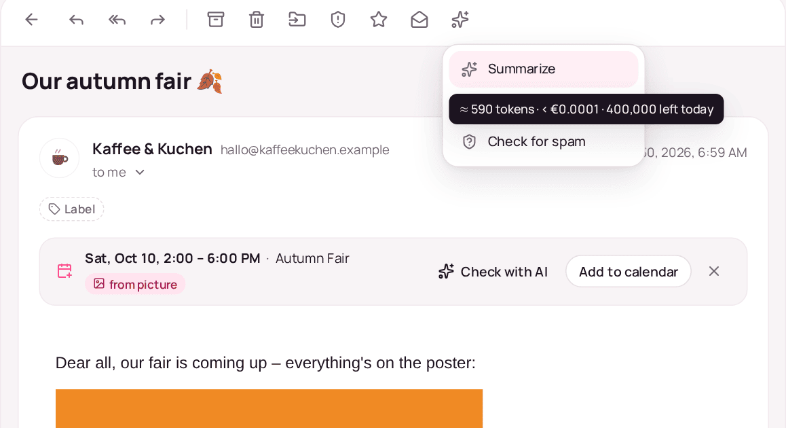
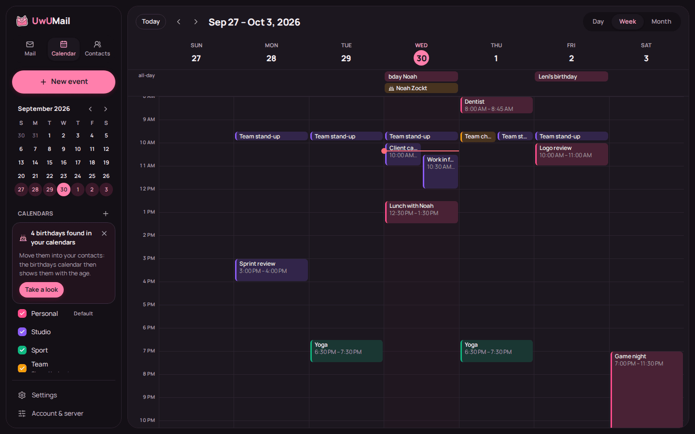
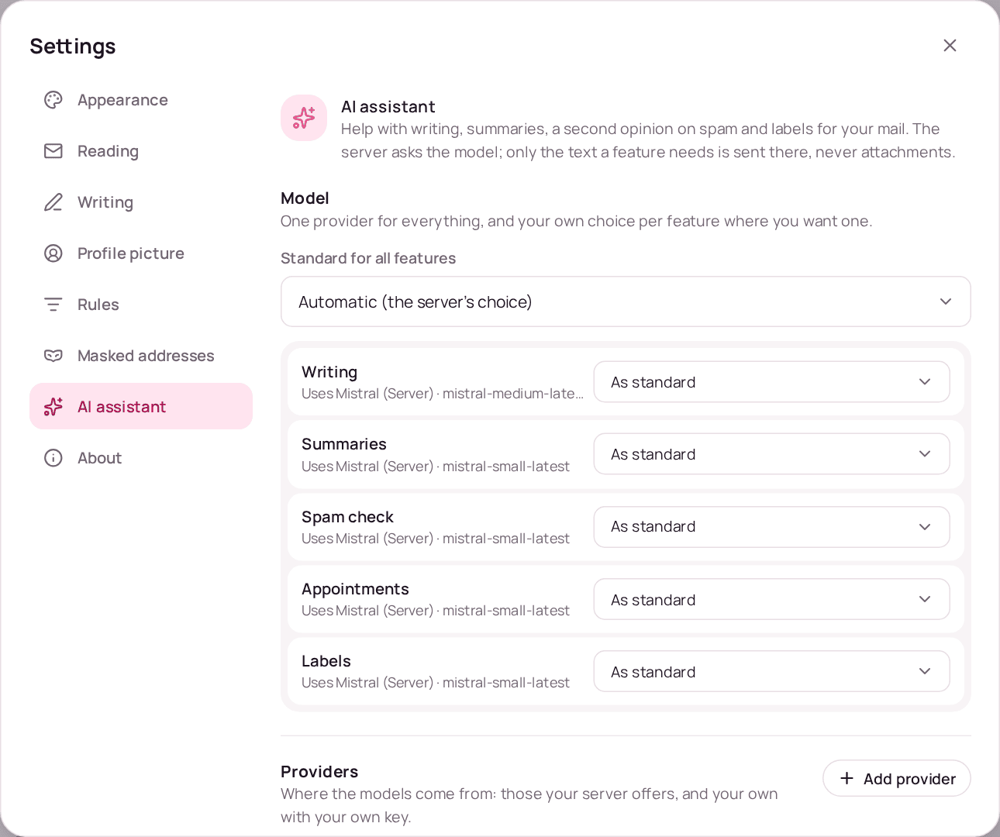
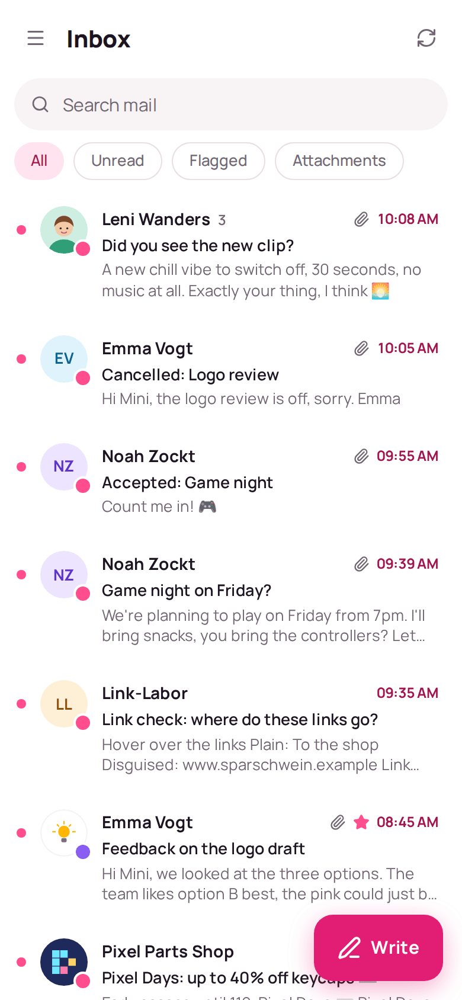

<p align="center">
  
</p>

<h1 align="center">UwUMail Webmail</h1>

<p align="center">
  The mailbox in the browser for my own mail server. (=^･ω･^=)<br/>
  React · JMAP · served by <a href="https://github.com/MinifyX/UwUMail-Server">UwUMail Server</a> under <code>/mail</code>
</p>

<p align="center">
  
</p>

---

## Why this exists

I build UwUMail for myself: an [app](https://github.com/MinifyX/UwUMail-Client)
for my own machines and a [server](https://github.com/MinifyX/UwUMail-Server)
for my own mail. What was missing is the case where the app isn't there — a
borrowed laptop, someone else's phone, a quick look from work. That's what this
is.

- **Just for fun.** No company, no team, no schedule, no promises. I work on it
  when I have time and feel like it.
- **Written with AI.** Almost all of the code is written with Claude, because
  I'm honestly not a great programmer. Not your thing? No hard feelings.
- **Use it, fork it, do what you want with it.** The license only asks one
  thing: changed versions stay open, even when you only run them as a service.
- **No support.** Issues and pull requests are okay, but I might answer late or
  not at all.

## What it is

The webmail is the UwUMail app's own interface, cut down to what a browser can
do well, talking to the server over JMAP. It is served by the mail server
itself, under `/mail`, and an admin can switch it off for the whole server or
for single accounts. The long version of every point is in
[docs/features.md](docs/features.md).

- **One login.** Whoever is signed in to the server's portal is signed in here,
  with two-factor, passkeys and the session list. No passwords kept in a browser.
- **Reads like the app.** Conversations, folder tree, search, attachments, spam
  and blocking, keyboard shortcuts, dark mode, six languages, playful or plain,
  and Nyu reacting to what you do (on, reduced or off).
- **Mail the server holds back.** Undo send and send later wait on the server,
  not in the tab. One-click unsubscribe (RFC 8058) is done by the server too.
- **Calendar, contacts and birthdays.** The same calendars and address books a
  phone syncs over CalDAV/CardDAV, plus a birthdays calendar with ages.
- **Appointments in mail.** Dates in text and pictures are underlined and go into
  the calendar prefilled; _Find appointment_ asks the AI on a click.
- **An AI assistant**, where the server has one: writing, summaries, spam second
  opinion, dates and labels, with the token count and cost before you click
  ([below](#ai-assistant)).
- **Shared folders, calendars and mailboxes**, masked addresses, contact photos
  and profile pictures.
- **Private pictures.** Remote content is blocked until you ask; then the server
  fetches it, every picture holds its place, and dead hosts hold nothing up.
- **Fits a phone.** Below 700 px it is the app's phone layout, it goes on the
  home screen, and notifications arrive with the tab closed (Web Push).

|                                                                                                                      |                                                                                                                                            |
| -------------------------------------------------------------------------------------------------------------------- | ------------------------------------------------------------------------------------------------------------------------------------------ |
|  |  |
| Nyu thinks while the model writes the summary; the date bar found the fair on the poster.                            | Hovering an AI action tells what it will cost before you click.                                                                            |
|                  |                                     |
| Calendar with the birthdays calendar, in dark mode.                                                                  | Settings → AI assistant: a model per feature, own providers, labels, usage.                                                                |

<p align="center">
  
</p>

## AI assistant

The webmail never talks to a language model itself: the server does, with the
providers its admin set up or that you added. Nothing is on until someone sets
up a provider, and nothing lands in a draft or changes a mail without a click
(except the labels you switched on).

**Setting it up**

1. **The admin** adds providers in the portal under _Server → Settings → AI
   assistant_: for everyone, some domains or some people, for some or all
   features, with daily limits per person in requests and tokens, and per
   provider a switch _Show costs to the people using it_. The same page decides
   whether people may bring their own providers, and whether those may sit in
   the local network.
2. **You** pick the model under _Settings → AI assistant_, for everything or per
   feature, and, if allowed, add your own provider with your own key. There you
   also switch on auto-labels or looking for appointments on every mail, and see
   what you used and what it cost.
3. **Local models:** an Ollama or LM Studio on the LAN works as a server
   provider (the admin gives its address), or as your own when the admin allows
   the local network. The browser can't reach your computer's `localhost`; the
   [UwUMail app](https://github.com/MinifyX/UwUMail-Client) finds a local Ollama
   or LM Studio by itself.

**Providers:** OpenAI, Anthropic Claude (API keys only), Google Gemini, Mistral,
OpenRouter, Ollama, any OpenAI-compatible server (LM Studio, vLLM, llama.cpp,
LiteLLM, …), and, experimental and only as your own, a ChatGPT subscription.

**Before you click**, hovering an AI button (a long press on touch) shows
"≈ 1,200 tokens · ≈ €0.02 · 48,000 left today". The cost shows for your own
providers, and for the server's only where the admin allows it. It is in euros,
yen or yuan by the language; in English you can choose US dollars.

**Privacy:** only the text a feature needs goes to the provider (no
attachments, no pictures, quoted history cut off), the answer names the
provider and model, keys stay sealed on the server, and the model gets no tools.
For mail that must not leave the house, use a local model.

More: [docs/ai-assistant.md](docs/ai-assistant.md), and the server's
[AI assistant guide](https://github.com/MinifyX/UwUMail-Server/blob/main/docs/llm.md).

## Working on it

```bash
pnpm install
cp .env.example .env.local   # point UWUMAIL_DEV_SERVER at a test server
pnpm dev                     # http://localhost:1440/mail/
pnpm dev:demo                # sample data, no server needed
pnpm build                   # typecheck, then dist/
```

`pnpm build` writes `dist/`, which the server bakes into its binary. The
server's container build clones this repository at a fixed commit, so a server
release always carries one known webmail state.

The service worker for notifications (`src/sw/`) is built on its own into
`dist/sw.js` and served as `/mail/sw.js`. `pnpm dev` has none, so push can only
be tried with a build served by the server.

## Documentation

- [Features](docs/features.md) — everything above, in detail
- [AI assistant](docs/ai-assistant.md) — setup, estimates and costs, privacy
- [Appointments in mail](docs/dates.md) — how dates are found and what goes where
- [Nyu animations](docs/nyu-animations.md) — the scenes, the setting and the rules they follow
- Security reviews: [0.18.0](docs/security-audit-0.18.0.md), [2026-09](docs/security-audit-2026-09.md)

## Licence

AGPL-3.0-only. See [LICENSE](LICENSE). Parts of the interface come from the
UwUMail app, which is GPL-3.0; I wrote both, so they are under the AGPL here.
